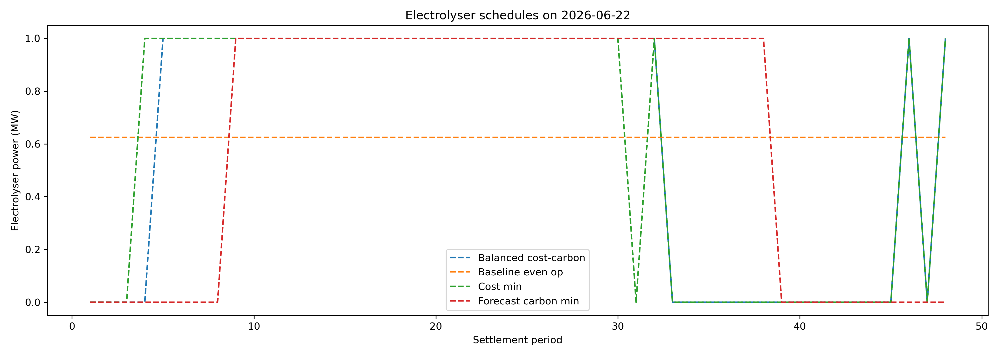

# Carbon-Aware Scheduling of Flexible Grid-Connected Hydrogen Production

## Contents

- [1. Aim and research question](#1-aim-and-research-question)
- [2. Data and assumptions](#2-data-and-assumptions)
- [3. Method](#3-method)
- [4. Results](#4-results)
  - [4.1 Base-case schedule comparison](#41-base-case-schedule-comparison)
  - [4.2 Forecast versus hindsight comparison](#42-forecast-versus-hindsight-comparison)
  - [4.3 Carbon value sensitivity](#43-carbon-value-sensitivity)
  - [4.4 Efficiency sensitivity](#44-efficiency-sensitivity)
  - [4.5 Constrained-operation extension](#45-constrained-operation-extension)
- [5. Discussion](#5-discussion)
- [6. Limitations](#6-limitations)
- [7. Conclusion](#7-conclusion)
- [8. References](#8-references)

## 1. Aim and research question
This project investigated whether the flexible operation of a grid-connected electrolyser can reduce electricity cost and carbon emissions compared with even operation. The model scheduled a simplified 1 MW electrolyser over seven complete days of half-hourly UK electricity price and carbon intensity data.

The project also compared the effects of optimising for cost-only, emissions-only and balanced strategies against even operation. A sensitivity analysis was conducted using the carbon value chosen, efficiency value for the electrolyser and by adding constraints to the operation.

## 2. Data and assumptions
This project uses half-hourly electricity price and carbon-intensity data for Great Britain. Carbon-intensity data were taken from the Carbon Intensity API, which provides forecast carbon intensity and estimated actual carbon intensity for the GB electricity system [1]. This allows the project to compare a forecast-based carbon schedule with a perfect-hindsight schedule based on actual carbon intensity.

Electricity price data were taken from Elexon’s system price data, which reports indicative £/MWh prices for settlement periods [2]. In this project, these data are used as a time-varying market price signal rather than a full delivered industrial electricity tariff.

The electrolyser is modelled as a simplified 1 MW grid-connected asset. It is required to produce 300 kg of hydrogen per day. The base-case electricity consumption is assumed to be 50 kWh/kg H2, which is consistent with the IEA’s assumption for low-temperature water electrolysis including compression [3]. This gives a daily electricity requirement of 15 MWh.

The balanced cost-carbon schedule uses UK Government Green Book carbon values for greenhouse-gas appraisal. The central 2026 value is £264/tCO2e, with £132/tCO2e and £396/tCO2e used as low and high sensitivity values [4].

**Table 2.1 Table of assumptions**
| Assumption | Value |
|---|---:|
| Electrolyser capacity | 1 MW |
| Hydrogen production target | 300 kg/day |
| Base electricity consumption | 50 kWh/kg H2 |
| Daily electricity requirement | 15 MWh/day |
| Settlement period length | 30 minutes |
| Maximum energy per period | 0.5 MWh |
| Model period | 7 complete days |
| Central carbon value | £264/tCO2e |
| Carbon value sensitivity | £132, £264, £396/tCO2e |
| Efficiency Sensitivity | 45, 50, 55 kWh/kg H2|

## 3. Method
All coding in the project was done in Python unless otherwise stated. The project workflow was first to pull data and process it before the data was used to optimise the scheduling. First the carbon intensity data and electricity data were pulled separately. The datasets were both cleaned and a settlement period was created, what 30 min period of the day was it and they were joined on the date and settlement period. SQL was used at the joining stage.

The modelling stage used an electrolyser with the assumptions listed in Section 2. The base case assumed even operation with the 15MWh spread evenly across the 48 half-hour periods and this provided a reference point. 

The flexible schedules tested how moving production into more favourable improves performance. To optimise the half-hour periods were ranked based on the variable to optimise and then selected the lowest cost or emissions. In the balanced cost-carbon strategy a monetary cost was added to the carbon and then combined into a total cost to minimise. In addition the actual carbon intensity was also minimised but this was not treated as an operation strategy but as a perfect benchmark for what the maximum emissions savings possible would be.

Each schedule was evaluated using the same metrics:
- Cost percentage savings compared to baseline schedule;
- Emissions percentage savings compared to baseline schedule;
the emissions percentage was judged using the actual carbon intensity as this represents the actual outcome and not the forecast which is used to build the model as that is all that can be known in advance.

After this comparison, a sensitivity analysis was conducted where the carbon values were changed to low, central and high to see how the balanced schedule changed when emissions weighting was changed. The efficiency sensitivity was tested at 45, 50 and 55 kWh/kg H2 while keeping the hydrogen target at 300kg per day to check whether the performance of strategies changed significantly when the electrolyser required more or less electricity to produce the same amount of hydrogen.

Finally, a constrained-operation extensions was added using pulp as the earlier optimiser assumes the electrolyser can switch freely between being in and out of use. This is an idealised case and so the PuLP model added two constrains, the electrolyser could start at most three times per day, and when it was on it had to operate at a minimum load of 0.2MW. This allowed the project to test whether the savings still held when the electrolyser has less operational freedom.
## 4. Results

### 4.1 Base-case schedule comparison
**Table 4.1 Base case schedule comparison**
| **Strategy** | **Cost Saving(%)** | **Emissions Saving(%)** |
|---|---:|---:|
| Cost-min | 36.1 | 7.3 |
| Forecast-carbon | 13.0 | 16.1 |
| Balanced | 35.2 | 11.5 |

As an example of how the schedule appears on a given day see Figure 4.1.

**Figure 1. Example daily operating schedule for selected strategies.**

### 4.2 Forecast versus hindsight comparison
The forecast-carbon schedule was compared with the actual-carbon schedule to assess how useful forecast carbon intensity was for scheduling. The actual-carbon schedule uses actual carbon intensity after the event, so it is treated as a perfect-hindsight benchmark rather than a realistic real-time strategy.
**Table 4.2 Forecast-carbon schedule compared with perfect hindsight.**

| Metric | Value |
|---|---:|
| Maximum possible emissions saving | 2.88 tCO₂ |
| Forecast-based emissions saving | 2.68 tCO₂ |
| Extra emissions versus hindsight | 0.201 tCO₂ |
| Share of maximum saving captured | 93.0% |

The maximum possible emissions saving in the model was 2.88 tCO₂, calculated as the difference between baseline emissions and the actual-carbon hindsight schedule. The forecast-carbon schedule achieved an emissions saving of 2.68 tCO₂, leaving 0.201 tCO₂ of additional emissions compared with the hindsight case. This means the forecast-carbon schedule captured 93.0% of the maximum emissions saving available under perfect hindsight.
This result should not be interpreted as the carbon forecast being 93.03% accurate. Rather, it shows that the forecast data were useful for scheduling in this model period.

### 4.3 Carbon value sensitivity
The carbon value sensitivity tested how the balanced cost-carbon schedule changed when emissions were given a lower or higher monetary weight. Three values were used: £132/tCO₂e, £264/tCO₂e and £396/tCO₂e. These represent the low, central and high carbon value assumptions used in the model.

**Table 4.3 Carbon value sensitivity results.**

| Carbon value (£/tCO₂e) | Cost saving (%) | Emissions saving (%) |
|---:|---:|---:|
| 132 | 35.74 | 9.22 |
| 264 | 35.22 | 11.51 |
| 396 | 34.73 | 12.35 |

As the carbon value increased from £132/tCO₂e to £396/tCO₂e, cost saving decreased from 35.74% to 34.73%. Over the same range, emissions saving increased from 9.22% to 12.35%. The central carbon value case produced a 35.22% cost saving and an 11.51% emissions saving.
### 4.4 Efficiency sensitivity
The efficiency sensitivity tested whether the results changed when the assumed electricity consumption of the electrolyser varied.
Three values were tested: 45, 50 and 55 kWh/kg H₂, while keeping hydrogen output fixed at 300 kg H₂ per day.
This changed total electricity used over the seven day period from 94.5 to 105 and to 115.5 MWh respectively.
The savings were compared to a baseline schedule for each case.

**Table 4.4 Efficiency sensitivity results.**

| Efficiency (kWh/kg H₂) | Strategy | Cost saving (%) | Emissions saving (%) |
|---:|---|---:|---:|
| 45 | Cost-min | 40.02 | 9.30 |
| 45 | Forecast-carbon | 17.62 | 19.65 |
| 45 | Balanced | 39.14 | 13.61 |
| 50 | Cost-min | 36.06 | 7.26 |
| 50 | Forecast-carbon | 12.98 | 16.14 |
| 50 | Balanced | 35.22 | 11.51 |
| 55 | Cost-min | 32.06 | 6.16 |
| 55 | Forecast-carbon | 8.76 | 13.15 |
| 55 | Balanced | 31.44 | 9.12 |

The results show that percentage savings decreased as electricity consumption increased. For example, the cost-minimising strategy’s cost saving fell from 40.02% at 45 kWh/kg H₂ to 32.06% at 55 kWh/kg H₂. The forecast-carbon strategy’s emissions saving also fell from 19.65% to 13.15% across the same range.
The balanced strategy followed the same pattern. Its cost saving fell from 39.14% to 31.44%, while its emissions saving fell from 13.61% to 9.12% as electricity consumption increased.

### 4.5 Constrained-operation extension
The constrained-operation extension tested whether the main results changed when additional operating constraints were added. The base optimiser assumes the electrolyser can switch freely between half-hour periods. The constrained model used PuLP to add two restrictions: a maximum of three starts per day and a minimum operating load of 0.2 MW when the electrolyser is on.

**Table 4.5 Unconstrained and constrained schedule comparison.**

| Strategy | Constraint case | Cost saving (%) | Emissions saving (%) |
|---|---|---:|---:|
| Cost-min | Unconstrained | 36.06 | 7.26 |
| Cost-min | Constrained | 35.66 | 7.23 |
| Forecast-carbon | Unconstrained | 12.98 | 16.14 |
| Forecast-carbon | Constrained | 13.07 | 16.15 |
| Balanced | Unconstrained | 35.22 | 11.51 |
| Balanced | Constrained | 34.94 | 11.20 |

The constrained schedules produced very similar results to the unconstrained schedules. For the cost-minimising strategy, cost saving changed from 36.06% to 35.66%, while emissions saving changed from 7.26% to 7.23%. For the balanced strategy, cost saving changed from 35.22% to 34.94%, while emissions saving changed from 11.51% to 11.20%. The forecast-carbon strategy also remained almost unchanged, with emissions saving moving from 16.14% to 16.15%.

This shows that, under the specific constraints tested, the constrained schedules produced almost the same cost and emissions outcomes as the unconstrained schedules.

## 5. Discussion
The results show that flexible electrolyser operation can reduce both electricity cost and emissions compared with even operation over the selected seven day period. This supports the central idea of the project: for a grid connected electrolyser, when electricity is consumed can matter as much as how much electricity is consumed. By shifting operation into more favourable half-hour periods, the model was able to improve both economic and environmental performance while still meeting the same daily hydrogen production target. 

The cost-minimising strategy achieved the largest financial saving, but it did not capture the full emissions benefit available in the model. In contrast, the carbon-minimising strategies achieved the larger emissions savings but lower cost savings. This highlights a clear trade-off between optimising purely for price and optimising purely for carbon intensity.

The balanced cost-carbon strategy is therefore important because it provides a compromise between these objectives. It preserved most of the cost saving from the cost-minimising schedule while improving emissions savings compared with price-only optimisation. This suggest that applying a carbon value can shift operation towards cleaner periods without removing most of the financial benefit of flexible operation.

The sensitivity result also supports the main findings. The carbon value sensitivity showed that increasing the carbon value increased emissions savings whilst only slightly reducing cost savings and hence the result held. The efficiency showed that savings declined as electricity consumption increased the cost and emissions savings reduced which is expected as it is less able to avoid expensive or high-carbon periods however the trends between schedules were still maintained.

The constrained-operation extension had little effect on the results. This suggests that, under the specific constraints tested, the unconstrained schedules were already relatively compatible with limited switching and minimum-load operation. However, this does not mean operational constraints are unimportant in general. Stricter constraints, start-up costs, ramp-rate limits or storage limitations could have a larger effect.
## 6. Limitations
This project uses a simplified model, so the results should be interpreted as an illustrative scheduling analysis rather than a full commercial assessment of hydrogen production. Some limitations are stated out below:

- The model uses only seven complete days of data which is enough to show the method however it does not capture seasonal variation, longer-term price patterns or unusual system conditions.

- The electricity price data used was a market price signal rather than an industrial tariff. A real electrolyser operator will face additional costs and constraints not captured in this model.

- The carbon-intensity data represent grid carbon intensity rather than project-specific marginal emissions. The emissions impact of changing electricity demand may differ depending on which generators respond at the margin.

Despite these limitations, the simplified model is useful for comparing scheduling strategies under consistent assumptions and for showing how price and carbon-intensity signals can be incorporated into flexible hydrogen production decisions.
## 7. Conclusion
This project showed that flexible scheduling of a grid-connected electrolyser can reduce both electricity cost and emissions compared with even operation over the selected seven-day period. The cost-minimising schedule achieved the largest cost saving, while the carbon-minimising schedules achieved the largest emissions savings.

The balanced cost-carbon schedule was the strongest practical compromise. It preserved most of the financial benefit of cost-only optimisation while improving emissions savings compared with the cost-minimising strategy. This shows the value of including a carbon signal in electrolyser scheduling, rather than optimising only for electricity price.

The forecast-versus-hindsight comparison also showed that forecast carbon intensity was useful for scheduling. The forecast-carbon schedule captured 93.03% of the maximum emissions saving available under the actual-carbon hindsight benchmark. This does not mean the forecast was 93.03% accurate, but it does show that forecast data could capture most of the available emissions-saving opportunity in this model period.

The sensitivity analysis showed that the main findings were robust across different carbon values and electrolyser efficiency assumptions. The constrained-operation extension also showed that adding a maximum-start constraint and minimum-load constraint had little effect under the tested assumptions. Overall, the project suggests that carbon-aware flexible operation could help grid-connected electrolysers reduce emissions while retaining much of the cost benefit of price-based optimisation.

## 8. References
[1] National Energy System Operator. *Carbon Intensity API*.  
[2] Elexon. *System Sell Buy Prices / Insights Solution*.  
[3] International Energy Agency. *Comparison of the emissions intensity of different hydrogen production routes, 2021*.  
[4] UK Government. *Valuation of greenhouse gas emissions: for policy appraisal and evaluation*.
